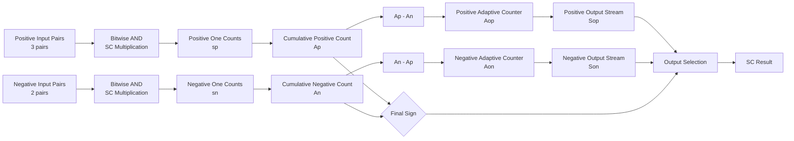
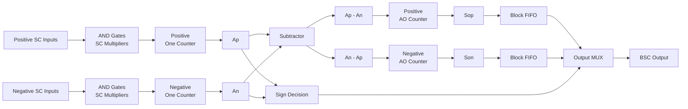
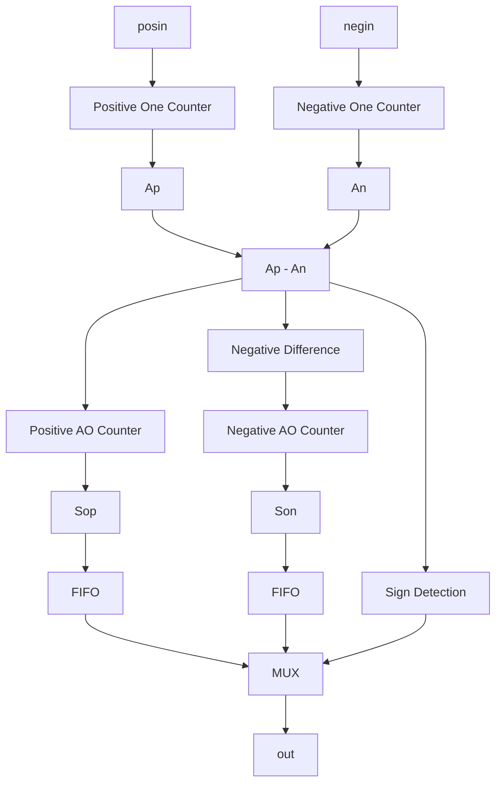

# Block-Based Stochastic Computing Hardware Design

This repository contains a software model and Verilog RTL implementation for a Block-Based Stochastic Computing (BSC) architecture.

The project evaluates signed stochastic multiply-accumulate operations using positive and negative stochastic products and implements the proposed processing scheme as synthesizable RTL.

## Overview

Conventional Stochastic Computing (SC) represents numerical values using the probability of `1` in a binary bitstream.

For multiplication, two stochastic bitstreams can be multiplied using a simple AND gate. However, arithmetic involving multiple positive and negative products requires additional logic for accumulation and sign handling.

This project separates the operation into two groups:

| Group             | Default Number of Products |
| ----------------- | -------------------------: |
| Positive products |                          3 |
| Negative products |                          2 |
| Block size        |                     8 bits |

Each multiplication is first performed using bitwise AND operations.

The numbers of `1`s generated by the positive and negative product groups are accumulated over a block. Their difference is then used to generate the output stochastic bitstream.

The repository consists of:

| Component                | Purpose                                           |
| ------------------------ | ------------------------------------------------- |
| C++ SC model             | Algorithm-level simulation and error evaluation   |
| Verilog BSC RTL          | Hardware implementation of block-based processing |
| Controller               | Block timing and valid signal generation          |
| One counters             | Accumulation of stochastic `1` bits               |
| Difference logic         | Positive/negative accumulated-value comparison    |
| Adaptive output counters | Output stochastic bit generation                  |
| FIFO                     | Output alignment between blocks                   |

---

# 1. Software SC Model

The software model generates random stochastic bitstreams and evaluates signed stochastic multiply-accumulate operations.

For the default configuration, three positive products and two negative products are generated.

Each product is calculated using bitwise AND:

```text
Product[i] = Input_A[i] AND Input_B[i]
```

For an 8-bit stochastic stream,

```text
A = 10110100
B = 11010101

A AND B
  = 10010100
```

The number of `1`s in the product stream represents the stochastic multiplication result.

## Software Processing Flow



### Positive and Negative Accumulation

At each bit position, the software calculates the number of positive and negative product bits.

```text
sp[i] = number of positive product bits equal to 1
sn[i] = number of negative product bits equal to 1
```

The values are accumulated across the stochastic block:

```text
Ap[i] = Ap[i-1] + sp[i]
An[i] = An[i-1] + sn[i]
```

The difference between the two accumulated values is then calculated.

```text
Ap - An
An - Ap
```

These values determine whether the next stochastic output bit becomes `0` or `1`.

### Adaptive Output Generation

For the positive output stream:

```text
if (Ap[i] - An[i]) > Aop[i]
    Sop[i] = 1
else
    Sop[i] = 0
```

The positive output accumulator is updated as

```text
Aop[i+1] = Aop[i] + Sop[i]
```

The negative path performs the same operation using `An - Ap`.

The final sign is determined by comparing the total positive and negative accumulated values.

```text
if Ap > An
    Output = Sop
else
    Output = Son
```

---

# 2. Reference Result and Error Evaluation

The C++ model also calculates a reference arithmetic result.

For each stochastic input stream, the number of `1`s is counted.

For two 8-bit input streams,

```text
Value(A) = Ones(A) / 8
Value(B) = Ones(B) / 8
```

Therefore,

```text
A × B = Ones(A) × Ones(B) / 64
```

The software accumulates all positive products and subtracts the negative products:

```text
Reference Result
= Sum(Positive Products)
- Sum(Negative Products)
```

The generated stochastic result is then compared with this reference result to obtain the error distance.

```text
SC Error Distance
= |Reference Result - SC Output|
```

The average error distance over multiple random experiments is reported at the end of the simulation.

---

# 3. RTL Architecture

The BSC architecture implements the same block-based stochastic processing concept in Verilog.



---

# 4. Top-Level Data Path

The top-level module is `bsc_mac`.

Stochastic multiplication is implemented using bitwise AND gates.

```verilog
wire [SIZE_POS-1:0] pos0 = pos0_0 & pos0_1;
wire [SIZE_NEG-1:0] neg0 = neg0_0 & neg0_1;
```

Because multiplication in unipolar stochastic computing can be implemented using an AND operation, no conventional binary multiplier is required for this stage.

The resulting positive and negative stochastic product streams are transferred to the `bsc_add` block.

---

# 5. BSC Adder

The `bsc_add` module is the main processing block.



The block performs four major operations:

| Stage | Operation                                                  |
| ----- | ---------------------------------------------------------- |
| 1     | Count positive and negative `1` bits                       |
| 2     | Compute accumulated positive/negative difference           |
| 3     | Generate positive and negative output stochastic bits      |
| 4     | Select the appropriate output stream using the result sign |

---

# 6. RTL Modules

## `bsc_mac.v`

Top-level stochastic multiply-accumulate datapath.

Main functions:

```text
SC input
→ AND multiplication
→ BSC addition
→ signed stochastic output
```

The module also instantiates the block controller.

---

## `bsc_add.v`

Main Block-Based Stochastic Computing arithmetic module.

It performs:

```text
Positive one accumulation
Negative one accumulation
Difference calculation
Adaptive output generation
Sign detection
Output selection
```

---

## `one_counter.v`

Counts the number of `1`s arriving during a stochastic block.

For multiple parallel stochastic inputs,

```text
sum = in[0] + in[1] + ... + in[N-1]
```

The sum is accumulated over multiple clock cycles.

This module is used for both:

```text
Positive/negative accumulated counts
Output stream population counts
```

---

## `sub.v`

Calculates the difference between the positive and negative accumulated values.

The subtraction is implemented using two's-complement arithmetic.

```text
A - B = A + ~B + 1
```

The result is sign-extended for signed comparison.

---

## `ao_cnt.v`

Implements the adaptive output counter.

The module compares the current accumulated difference with the number of output `1`s already generated.

Conceptually:

```text
if difference > generated_ones
    output_bit = 1
else
    output_bit = 0
```

The counter therefore converts the accumulated difference back into a stochastic bitstream.

---

## `fifo.v`

Implements a shift-register FIFO.

The generated stochastic output is delayed by one block so that the output stream is aligned with the block-level sign decision.

For the default configuration:

```text
FIFO depth = 8 cycles
```

---

## `ctrl.v`

Controls block timing.

For `SIZE_BLOCK = 8`, the controller tracks each 8-cycle stochastic block and generates:

```text
done_block
valid_out
```

These signals synchronize accumulation, restart, sign selection, and output validity.

---

# 7. Block Operation Example

For the default configuration:

```text
Block Size       = 8 cycles
Positive Inputs  = 3 product streams
Negative Inputs  = 2 product streams
```

During each clock cycle:

```text
1. Positive and negative input pairs are multiplied using AND gates.
2. The number of positive product bits equal to 1 is counted.
3. The number of negative product bits equal to 1 is counted.
4. Ap and An are accumulated.
5. Their difference determines the generated output bit.
```

After one complete block:

```text
Ap > An → positive stochastic output
Ap < An → negative stochastic output
```

The resulting stochastic stream represents the magnitude while the `sign` signal represents its polarity.

---

# 8. Repository Structure

```text
BSC-Hardware-Design/
│
├── README.md
│
├── software_model/
│   └── sc_reference.cpp
│
├── rtl/
│   ├── bsc_mac.v
│   ├── bsc_add.v
│   ├── one_counter.v
│   ├── ao_cnt.v
│   ├── sub.v
│   ├── fifo.v
│   └── ctrl.v
│
└── docs/
    └── architecture/
```

---

# 9. Technologies

| Category              | Technology                       |
| --------------------- | -------------------------------- |
| RTL Design            | Verilog HDL                      |
| Software Modeling     | C++                              |
| Stochastic Arithmetic | Stochastic Computing             |
| Arithmetic Design     | Block-Based Stochastic Computing |
| Verification          | Software/RTL result comparison   |
| FPGA Tool Flow        | Xilinx Vivado                    |

---

# 10. Project Purpose

The purpose of this project is to study hardware-efficient stochastic arithmetic and implement a block-based architecture that supports signed stochastic accumulation.

The project demonstrates experience in:

```text
Algorithm modeling
C++ reference implementation
Verilog RTL design
Parameterized hardware modules
Streaming datapath design
Signed arithmetic
Hardware control logic
Stochastic arithmetic
Hardware/software verification
```
